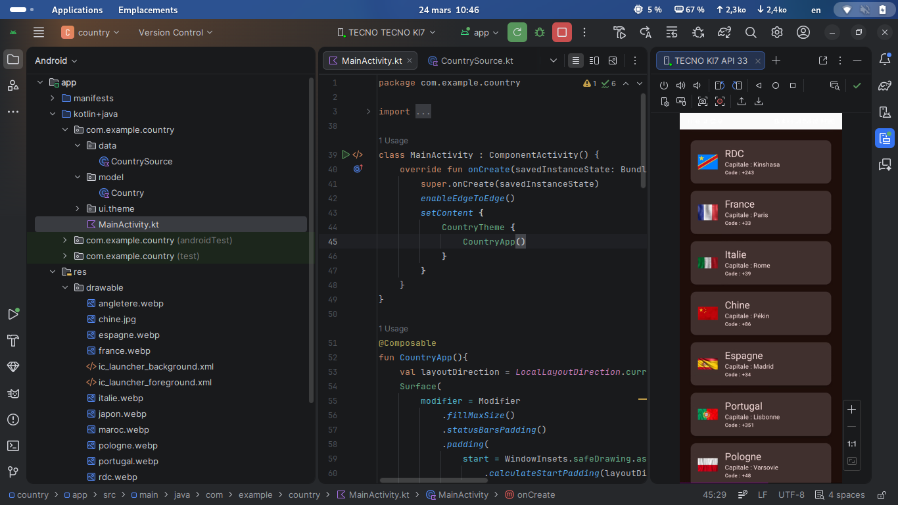

# Mon Projet Liste des Pays en Kotlin

Voici un aperçu de l'application :

## Fonctionnalités

- Affichage d'une liste avec `LazyColumn`.
- Manipulation de données avec une `Data Class`.
- Design moderne avec `Jetpack Compose`.